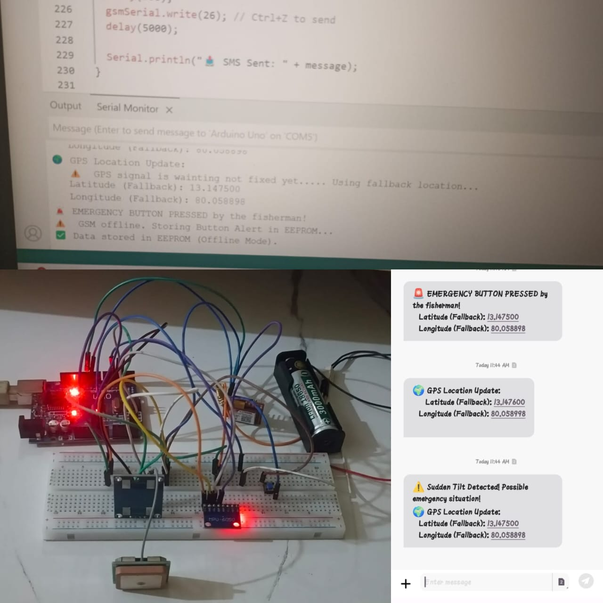
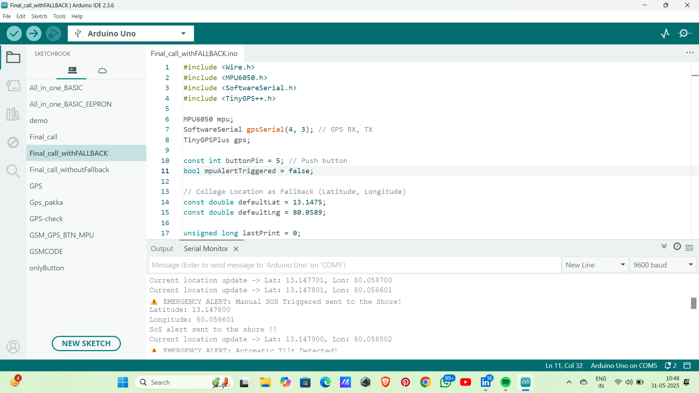
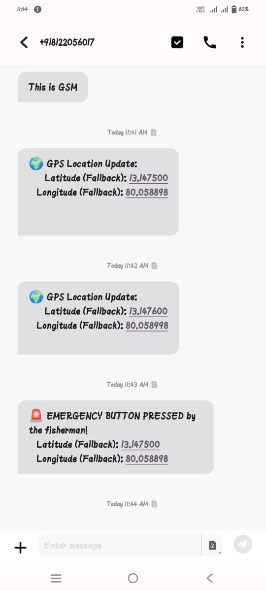

# 🌊 Deep Sea Fisherman Tracking System using IoT

### 🏆 Awarded *Best Paper* at ICITE 2025, Jaya Engineering College

---

## 📘 Project Overview
This IoT-based system ensures the **safety of fishermen** venturing into deep-sea regions by providing **real-time tracking** and **emergency alerts**.  
It combines **GPS**, **GSM**, and **MPU6050** sensors with **Arduino Uno**, allowing continuous monitoring and alerting even when the GSM network fails.

If a fisherman faces an emergency or accident, the system automatically triggers an **SOS message** or can be manually triggered via a **push button**.  
When GSM fails, the **GPS data is locally stored** and automatically transmitted once the network reconnects.

---

## 🧠 Core Features
- 📍 Real-time GPS location tracking  
- 📶 GSM-based data transmission  
- ⚠️ Automatic SOS detection using MPU6050 (tilt detection)  
- 🧾 Local data storage during GSM failure  
- 🔁 Auto-sync once the network is available  
- 🔘 Manual SOS trigger via button  

---

## 🧩 Hardware Components
| Component | Purpose |
|------------|----------|
| Arduino Uno | Main microcontroller |
| SIM800L GSM Module | Sends data and alerts |
| NEO-6M GPS Module | Fetches coordinates |
| MPU6050 Sensor | Detects tilt and motion |
| Push Button | Manual SOS trigger |
| Power Supply | Provides 5V regulated power |

---

## ⚙️ Connection Description

**🟢 Push Button**

D2 ---| |--- GND

**🔵 MPU6050**
| MPU6050 Pin | Arduino Pin |
|--------------|--------------|
| VCC | 5V |
| GND | GND |
| SDA | A4 |
| SCL | A5 |

**🟣 GPS Module**
| GPS Pin | Arduino Pin |
|----------|--------------|
| VCC | 5V |
| GND | GND |
| TX | D9 |
| RX | D8 |

**🟡 GSM Module**
| GSM Pin | Arduino Pin |
|----------|--------------|
| VCC | 5V (External or Breadboard) |
| RST | — |
| RXD | D5 |
| TXD | D4 |
| GND | GND (common) |

> ⚠️ **Important:** Use a common GND for all modules. GSM requires a stable power source (can use a separate 5V supply).

---

## 🗂 Repository Structure

*** View or checkout the Folder_structure file

---

## 🏅 Achievement – Best Paper Award

We are proud to announce that this project received the **🏆 Best Paper Award** at the  
**International Conference on Innovative Trends in Engineering (ICITE 2025)**  
organized by **Jaya Engineering College, Chennai**.

### 📄 Publication Details
- **Conference:** ICITE 2025 – International Conference on Innovative Trends in Engineering  
- **Organizer:** Jaya Engineering College  
- **Award:** 🏆 *Best Paper Award*  
- **Paper Title:** *AI-ML Based GIS Application for Detecting Fishermen’s Location in Deep Sea Fishing*  
- **Serial No.:** 19  
- **Page No.:** 131  
- **Published Paper:** [ICITE_Conference_Paper.pdf](./LICENCE/ICITE_Conference_Paper.pdf)

### 🔍 How to Locate Our Paper
1. Open the attached file **`ICITE_Conference_Paper.pdf`** (inside the `LICENCE` folder).  
2. In the **Index Page**, find **Serial No. 19**.  
3. Turn to **Page No. 131** to view our complete paper.

---

## 🖼️ Project Snapshots

| Description | Image |
|--------------|-------|
| Final Prototype |  |
| Hardware Overview |  |
| Serial Monitor Output |  |
| SMS Alert Example |  |

---

## 💡 Future Enhancements
- Integrate **LoRa** for long-range communication.  
- Add **real-time map tracking** using a web dashboard.  
- Include **AI-based weather prediction alerts** for fishermen.  

---

## 👩‍💻 Authors
- **Raabiya N** – Aalim Muhamed Salegh College of Engineering  
- *(Add your teammates’ names if applicable)*

---

## 📬 Contact
For queries or collaboration:  
📧 nraabiya13@gmail.com

---

## 📜 License
This project is shared for academic and educational use.  
All rights reserved © 2025 – *Deep Sea Fisherman Tracking System using IoT*.

---

